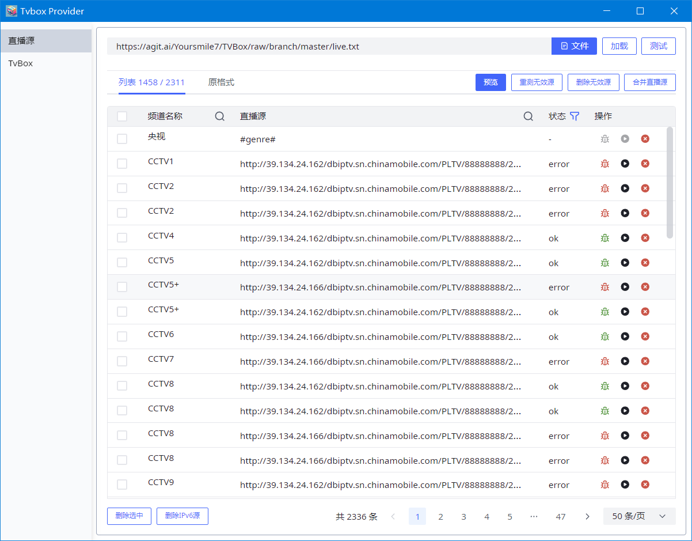
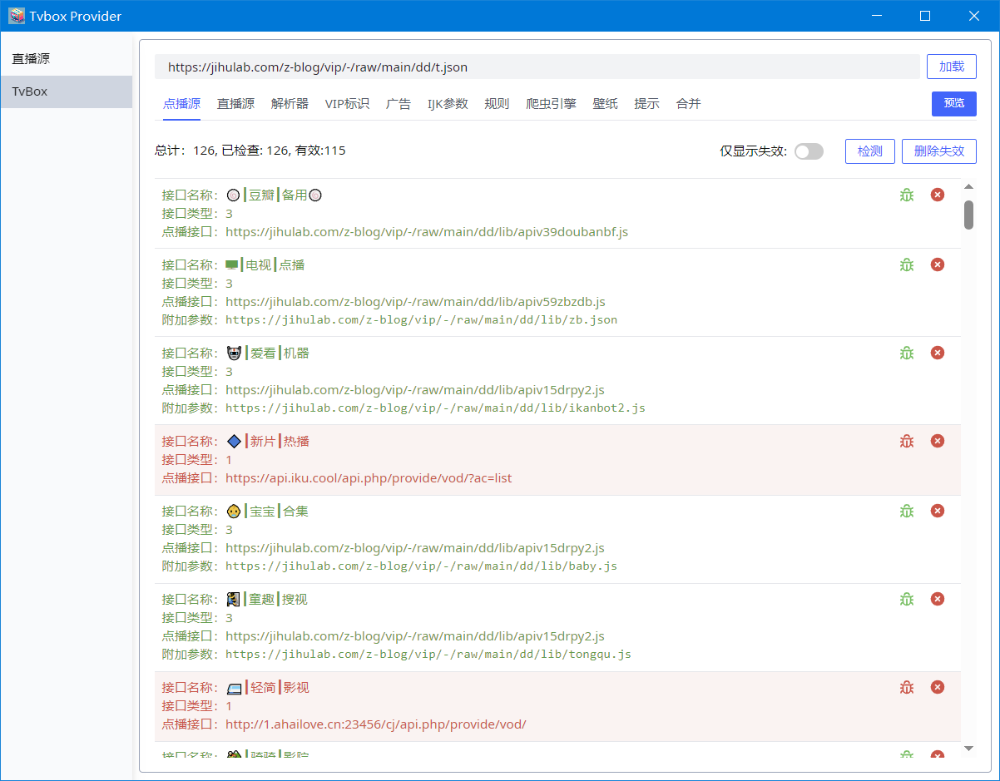

# Tvbox Source Provider


tvbox 视频源检测与合并工具
<div style="display:flex;">


</div>

## 构建

Windows

```powershell
# release 构建
# $env:TAURI_PRIVATE_KEY=""
# $env:TAURI_KEY_PASSWORD=""

npm install
npm tauri build
# or
yarn install
yarn tauri build

```

## 注意

1. IPv6的视频源或直播源在IPv4网络下是无法连接的。
2. 视频播放当前依赖于mpv播放器[https://github.com/mpv-player/mpv](https://github.com/mpv-player/mpv)
3. 直播源测试用的mpv播放器目前仅在Windows下可用

## 跨平台编译Linux版本

详情参考： [https://tauri.app/v1/guides/building/](https://tauri.app/v1/guides/building/)
以下为基于docker构建debain/Ubuntu版本

```bash
docker run --rm -it -v "${pwd}:/home/rust/src" -v "${env:userprofile}/.cargo/registry:/usr/local/cargo/registry" -v "${env:userprofile}/.cargo/config:/usr/local/cargo/config" rust:1.70-bullseye


# 修改软件源镜像
sed -i 's#http://deb.debian.org#https://mirrors.ustc.edu.cn#g' /etc/apt/sources.list
sed -i 's#http://security.debian.org#http://mirrors.ustc.edu.cn#g' /etc/apt/sources.list

# 安装必要的软件
apt update -y && apt-get install libssl-dev libgtk-3-dev libwebkit2gtk-4.0-dev libappindicator3-dev librsvg2-dev patchelf -y
# 安装 nodejs
# https://nodejs.org/en/download/package-manager#debian-and-ubuntu-based-linux-distributions

curl -fsSL https://deb.nodesource.com/setup_18.x | bash - &&\
apt-get install -y nodejs

# 安装yarn
npm -g i yarn
# 安装依赖
yarn
# 构建
yarn tauri build

# AppImage软件包的构建依赖于github相关脚本，如需构建AppImage版本请务必保证可以正常访问github


```
